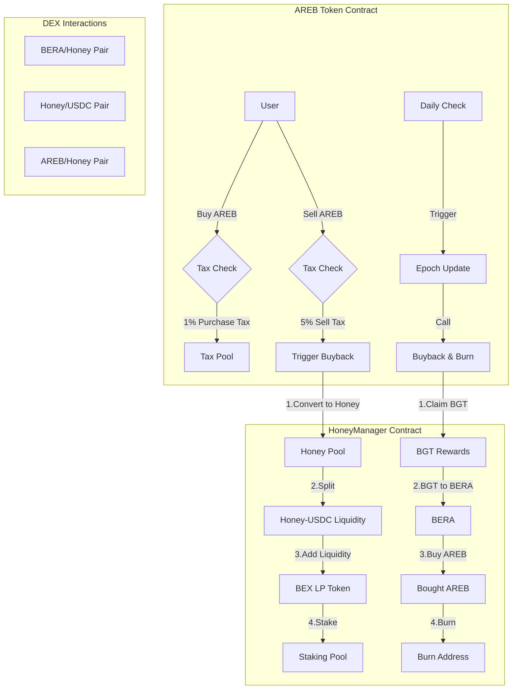

# AREB Token Project Overview

## 🌟 Project Introduction

AREB is an innovative tokenomics model implementing an automated liquidity management and buyback system on the Berachain ecosystem. The project combines dynamic tax mechanisms with liquidity provision to create a sustainable token economy.




## 🔄 Core Mechanisms

### Tax System
- **Purchase Tax**: 1% on buys
  - Accumulated for liquidity and buybacks
  - Minimal impact on entry
- **Sell Tax**: 5% on sells
  - Higher rate to discourage large dumps
  - Automatically converted to support token value

### Automated Liquidity Management
- **Split Mechanism**: Tax collected in HONEY is split 50/50
- **Pair Creation**: HONEY-USDC pair on BEX
- **LP Tokens**: Automatically staked for BGT rewards
- **Yield Generation**: Continuous BGT earnings from LP staking

### Smart Buyback System
- **Daily Execution**: Automated epoch-based triggers
- **Multi-Step Process**:
  1. Claim BGT rewards from staking
  2. Convert BGT to BERA
  3. Use BERA to buy back AREB
  4. Burn purchased tokens permanently

## 💡 Technical Innovation

### Smart Contract Integration
- Seamless interaction with DEX protocols
- Advanced swap router implementation
- Secure staking vault integration
- Efficient tax collection and distribution

### Safety Features
- Immutable core parameters
- Automated process execution
- Built-in security checks
- Error handling mechanisms

## 🎯 Benefits

### For Token Holders
- 📈 Constant buy pressure from automated buybacks
- 💪 Strong price support through liquidity management
- 🔒 Reduced sell pressure due to tax mechanism
- 📊 Decreasing token supply through burns

### For the Ecosystem
- 🌊 Deep liquidity pools
- 🔄 Increased trading volume
- 🏦 Sustainable tokenomics
- 🛡️ Protected token value

## 🔧 Technical Architecture

```plaintext
User Interactions
     ↓
AREB Token Contract
     ↓
Tax Collection & Distribution
     ↓
HoneyManager (Liquidity & Buyback)
     ↓
DEX Integration (BEX/CrocSwap)
```

## 🚀 Future Development

- Enhanced reward mechanisms
- Additional LP pair implementations
- Governance features
- Community-driven parameters

## ⚙️ Integration Points

- Berachain Network
- BEX DEX
- CrocSwap Protocol
- BGT Reward System

## 🎁 Unique Value Proposition

AREB represents a new generation of tokenomics, where traditional token mechanics meet automated market making and liquidity management. The system creates a self-sustaining ecosystem that benefits both traders and holders through its innovative approach to value accrual and distribution.

---

*AREB: Building a Sustainable Token Economy on Berachain*

## Usage

### Build

```shell
$ forge build
```

### Test

```shell
$ forge test
```

### Format

```shell
$ forge fmt
```

### Gas Snapshots

```shell
$ forge snapshot
```

### Anvil

```shell
$ anvil
```

### Deploy

```shell
$ forge script script/Counter.s.sol:CounterScript --rpc-url <your_rpc_url> --private-key <your_private_key>
```

### Cast

```shell
$ cast <subcommand>
```

### Help

```shell
$ forge --help
$ anvil --help
$ cast --help
```
